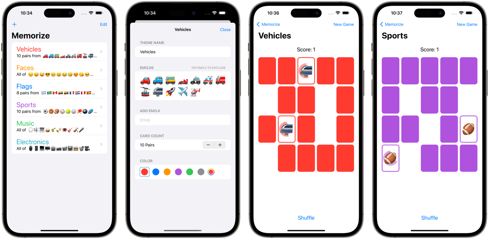

# Memorize

Assignments 1, 2 & 6 for [Stanford University's course CS193p](https://cs193p.sites.stanford.edu) (Developing Applications for iOS) of Spring 2021.

## Assignment Instructions
- [Assignment 1 (PDF)](https://cs193p.sites.stanford.edu/sites/g/files/sbiybj16636/files/media/file/assignment_1.pdf)
- [Assignment 2 (PDF)](https://cs193p.sites.stanford.edu/sites/g/files/sbiybj16636/files/media/file/Assignment%202.pdf)
- [Assignment 6 (PDF)](https://cs193p.sites.stanford.edu/sites/g/files/sbiybj16636/files/media/file/assignment_6.pdf)

## Explanation of the Game
`Memorize` is a card-matching game. One can create and edit themes of cards. The game ends when all the pairs of cards have been matched.

## Technologies
- SwiftUI
- MVVM Architecture

## Topics Covered
- Basic Views (eg: Text, Button, Image, TextField)
- Putting Views together using container Views (e.g: VStack, HStack, List, Form, NavigationView)
- ViewBuilder
- ViewModifiers
- @State and @ObservedObject
- SF Symbols
- Modal presentation
- EditMode
- UserDefaults
- Using new API (e.g: Stepper, ColorPicker)

## Screenshots

